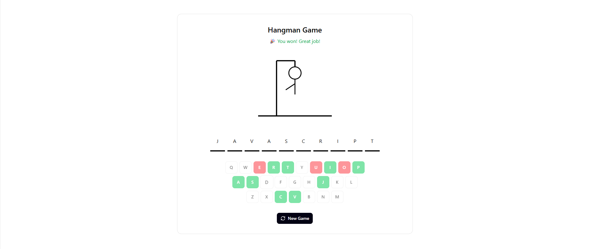

# Juego del Ahorcado en PHP

<div align=center>
  
</div>

Este es un proyecto sencillo en *PHP* que implementa el clásico juego de *Ahorcado* como un juego basado en navegador, utilizando sesiones para gestionar el estado del juego.


## Tabla de contenidos

- [Requisitos](#requisitos)
- [Puesta en marcha](#puesta-en-marcha)
- [Estructura de archivos](#estructura-de-archivos)
- [Mockup](#mockup)
- [Flujo de uso](#flujo-de-uso)
- [Arquitectura del sistema](#arquitectura-del-sistema)
- [Registro de cambios (Changelog)](#registro-de-cambios-changelog)


## Requisitos

- Tener docker y contenedor de docker de **PHP >= 7.4**.
- Un navegador web.
- Archivo `style.css` para mejorar el estilo.


## Puesta en marcha

1. Inicie el proyecto ejecutando el comando:

```bash
docker compose up -d --build
```

2. Una vez en funcionamiento, acceda a la aplicación desde su navegador en [http://localhost:8080](http://localhost:8080/).
3. Para detener y eliminar los contenedores, ejecute:

```bash
docker compose down
```


## Estructura de archivos

```

```

## Mockup

<div align=center>
  
</div>


## Flujo de uso

1. `Storage` carga estado de sesión.
2. `WordProvider` da la palabra inicial si no existe.
3. `Game` gestiona lógica de letras e intentos.
4. `Storage` guarda de nuevo el estado (`toState()`).
5. `Renderer` convierte intentos restantes en el dibujo ASCII.
6. `index.php` genera HTML con datos de `Game` + `Renderer`.


## Arquitectura del sistema

```code
WordProvider  ──►  Game  ◄── Storage
       │               │
       └──────────────►│
                       │
                   Renderer
```

- **WordProvider**: obtiene palabras desde ficheros u otras fuentes.
- **Game**: encapsula la lógica del juego (estado, intentos, victoria/derrota).
- **Storage**: maneja la persistencia del estado (sesiones).
- **Renderer**: dibuja el ahorcado en ASCII según intentos restantes.


## Registro de cambios (Changelog)

### **Versión 1.0.1** — *5 de octubre de 2025*

- Refactorización del proyecto base para estructurarlo en cuatro clases principales: `WordProvider`, `Game`, `Storage` y `Renderer`.
- Mejora de la organización del código y separación de responsabilidades.

### **Versión 1.0.0** — *3 de octubre de 2025*

- Versión inicial del proyecto base proporcionado por el profesor.